# Garden Room Hair Salon

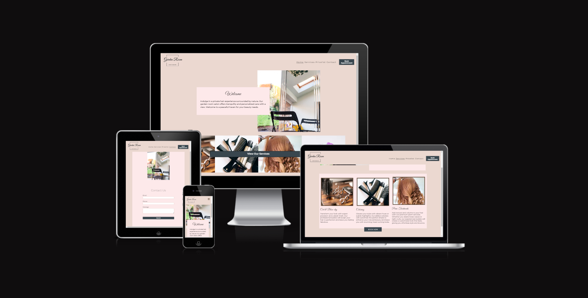

Garden room hair salon is a website where users can find out more about a hairdresser and the services they provide. The user will be able to check the availability and book an appointment with the hairdresser through a third party app called timely.

## Client Goals

- Provide a website that can clearly demonstrate the services offered to a potential cusomer.
- Include images and a nice design to attract customers.
- Offer a book appointments button throughout the site to increase chances of booking.
- Deliver a seamless user-friendly interface with great web flow.

## Planning

### Balsamiq Templates

#### Home

#### Services

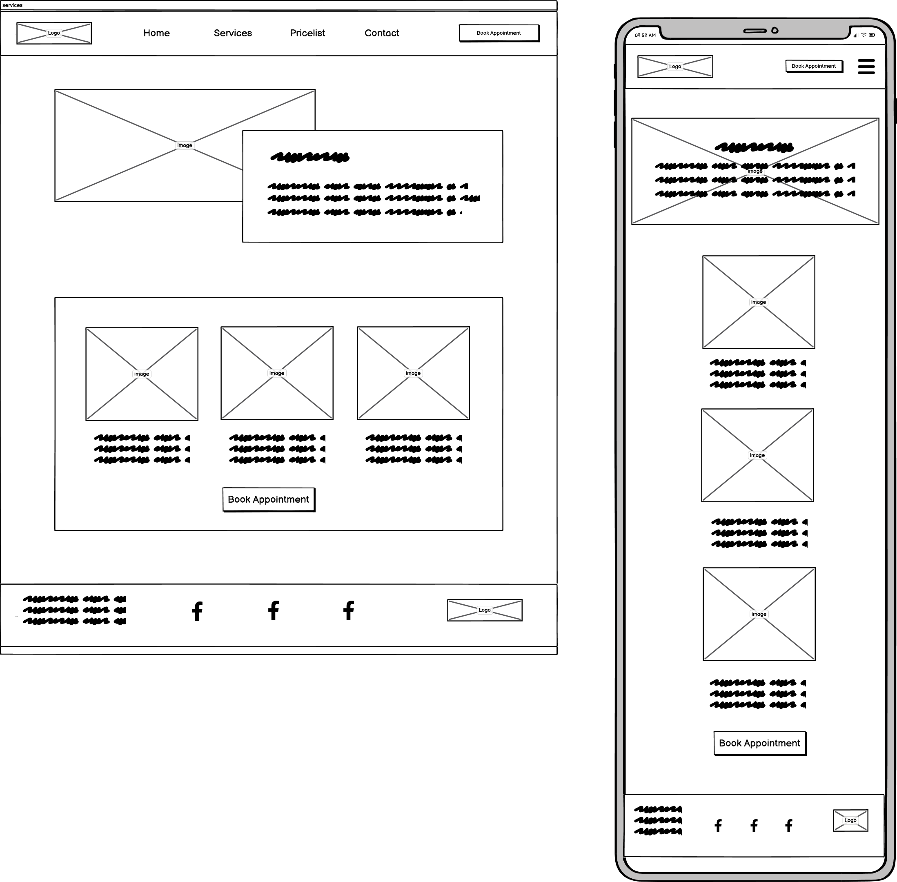

#### Pricelist

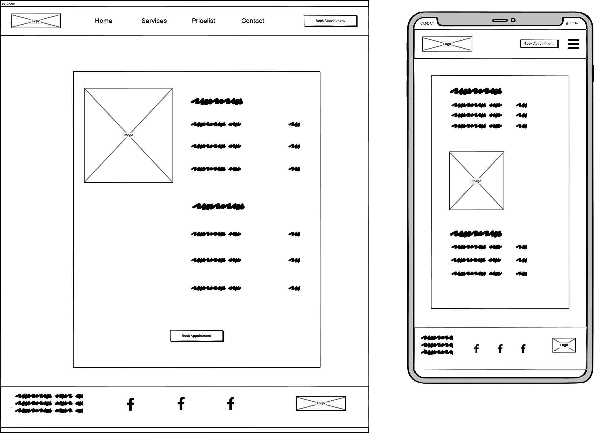

#### Contact

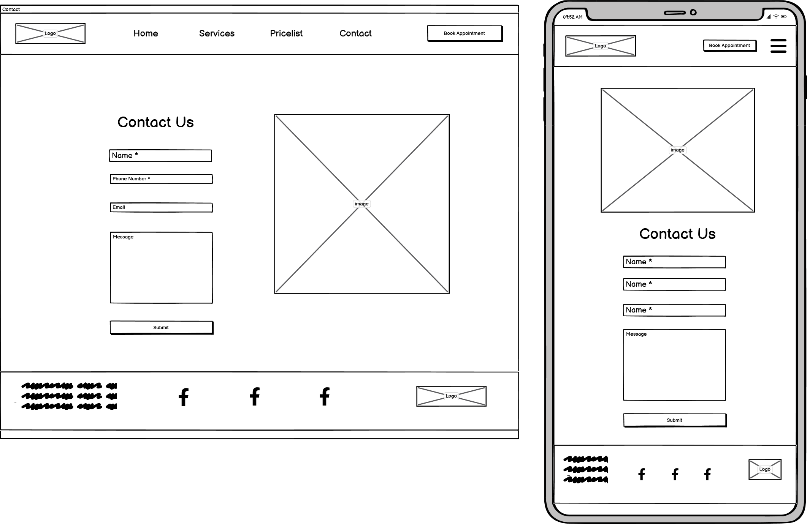

### Color Palette

Used as inspiration for the websites design.

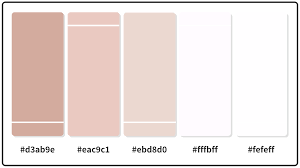

### Fonts

I will be using google fonts for this project. I have chosen to focus on using only two fonts that compliment each other nicely.

1. Great Vibes
2. Montserrat

I may use multiple styles of the Montserrat font such as bold, semi-bold or italic to represent the visual importance of the text or to provide contrast if text is over an image.

## Features

### Navigation Menu

- Includes links to the Home, Services, Pricelist, and Contact pages, ensuring responsiveness across all devices.
- Facilitates seamless navigation between site pages on any screen size.

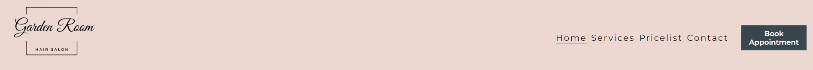

### Footer

- Features icons linked to social media platforms, designed to open in new tabs for enhanced user experience.
- Ensures accessibility for visually impaired users via aria labels, enabling screen reader compatibility.
- Enables users to connect with relevant social media pages for additional and timely updates beyond the website's content.

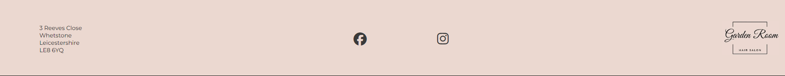

### Home Page

- Home Page image

  - An image that captures the essence of the business to instantly inform the user on the focus of the business.

- Services Section
  - Brief information about Services provided with a link for the user to follow to the services page.
  - This information lets the user know what the business/site is about.

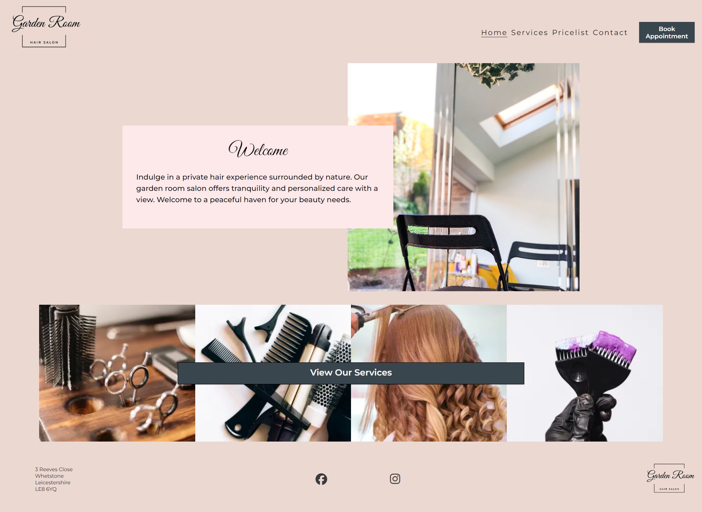

### Services Page

- Title / Brief description / image

  - So the user can easily see the page they are visiting

- Service images

  - Each image will represent a service provided with relevant text below to describe the service

- Book Appointment button
  - To prompt the user to booking an appointment, making it convinient for the user, keeping to the goal of gaining customers for the business.

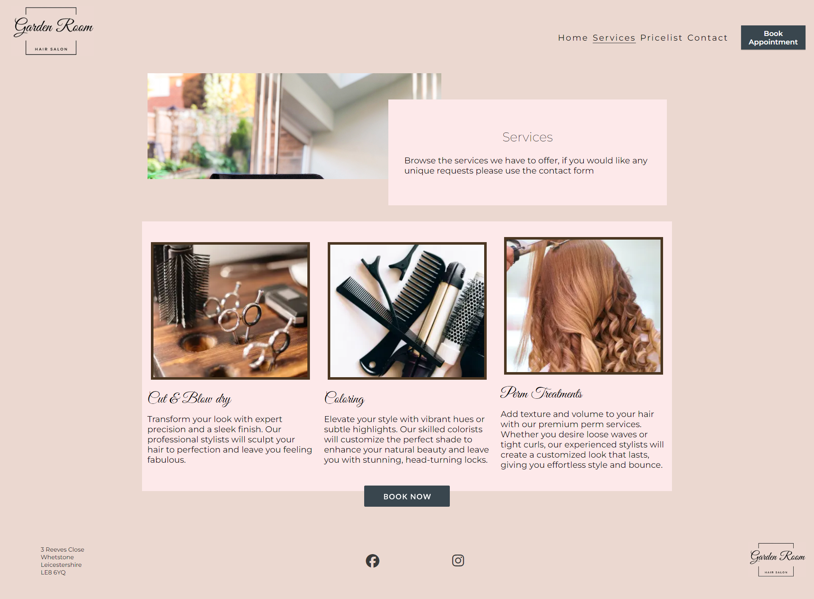

### Pricelist Page

- image

  - Making the page visually appealing.

- Pricelist
  - A simple pricelist to indicate general costs of services.

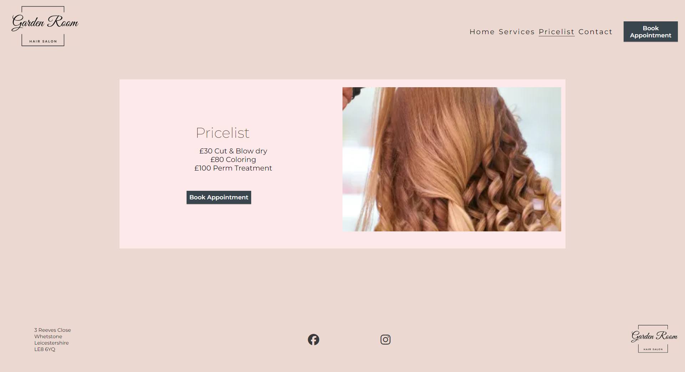

### Contact Page

- Form for a quick method to contact the business owner about enquiries
- email (required, type=email)
- phone number (required, type=tel)
- message (optional type=textarea)

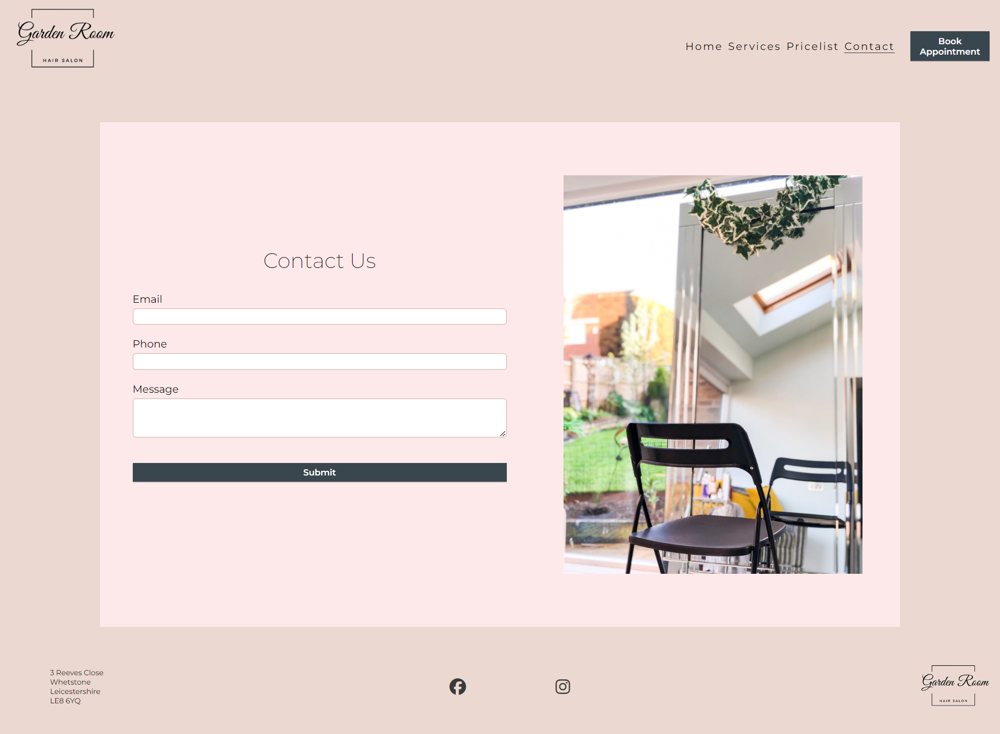

### Favicon

- A site-wide favicon featuring a relevant icon or logo will be integrated.
- Enhances user experience by providing a visual identifier in the browser's tab header, facilitating easy recognition, especially when multiple tabs are open.

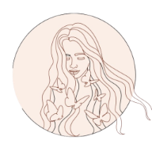

### 404 Page

- A custom 404 page will be implemented to display when users encounter a broken link.
- Offers seamless navigation back to the main website, eliminating reliance on the browser's back button, in case of encountering a broken link or missing page.

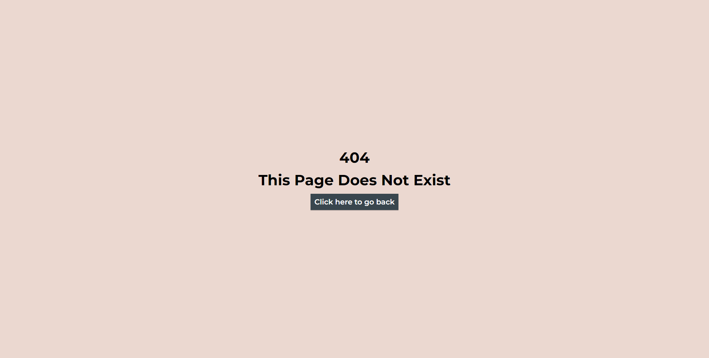

### Thankyou Page

- The thankyou page has been created to provide feedback to the user once they have submitted the contact form. This will help provide a good user experience.

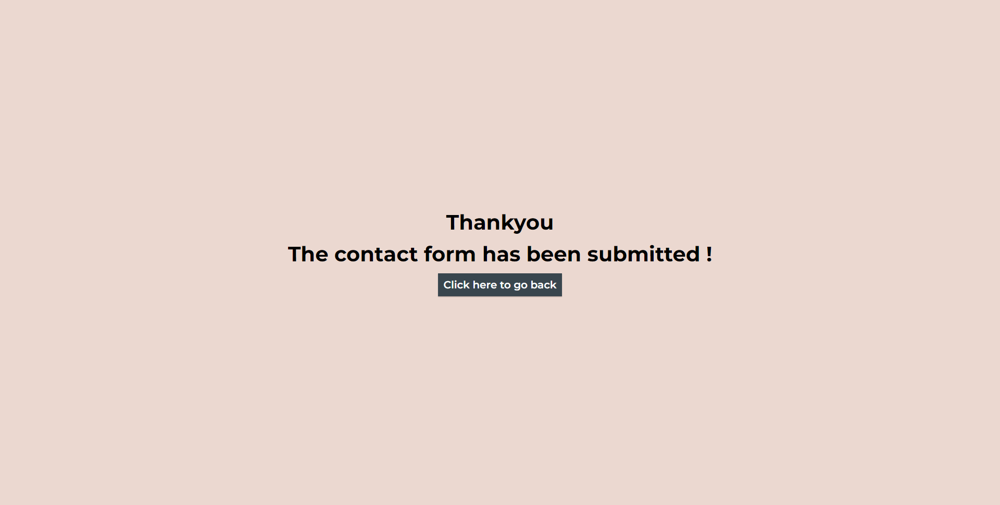

## Testing

### Responsiveness

All pages underwent testing to verify their responsiveness across various screen sizes, starting from 320px and above, adhering to the [WCAG 2.1 Reflow criteria](https://www.w3.org/WAI/WCAG21/Understanding/reflow.html) for responsive design. This testing was conducted on Chrome, Edge, Firefox, and Opera browsers.

#### Testing Procedure:

1. Open the browser and navigate to [Garden Room Hair Salon](https://jxkeorton.github.io/hair-salon/).
2. Open the developer tools by right-clicking and selecting inspect.
3. Set the view to responsive mode and decrease the width to 320px.
4. Adjust the zoom level to 50%.
5. Click and drag the responsive window to its maximum width.

#### Expected Outcome:

The website should display responsiveness across all screen sizes without any pixelation or stretching of images. Horizontal scrolling should be absent, and no elements should overlap.

#### Observed Outcome:

The website performed as expected.

Additionally, the website was tested on IphoneX and no responsiveness issues were detected.

### Accessibility

Throughout final testing of the deployed website, the [Wave](https://wave.webaim.org/) Accessibility tool was employed to ensure comprehensive accessibility testing.

The testing primarily focused on confirming adherence to the following criteria:

- All forms include associated labels or aria-labels, ensuring that screen readers announce these labels to users who navigate to form inputs.
- Color contrasts meet the minimum ratio specified in the WCAG 2.1 Contrast Guidelines.
- Heading levels are appropriately structured to avoid skipping or missing levels, effectively conveying the importance of content to end users.
- All content is enclosed within landmarks, facilitating ease of navigation for assistive technology users by organizing content into distinct page regions.
- Non-textual content is accompanied by alternative text or titles to provide descriptions that can be read by screen readers.
- The HTML page includes a lang attribute to specify the language used.
- Aria properties are implemented correctly to enhance accessibility features.
- Compliance with [WCAG 2.1](https://www.w3.org/WAI/WCAG21/Understanding/contrast-minimum.html) coding best practices is ensured.

#### Findings with Wave

- Form inputs were not correctly linked to the relevant labels, this was corrected by adding the id attribute with a relevant value to the input elements.
- Timely buttons were importing images without alt attributes. So i changed all buttons to include a link instead of using the script element with a link to their javascript.

### Lighthouse

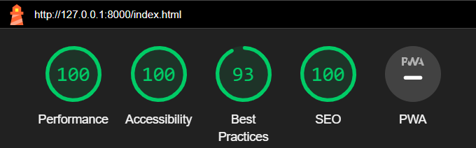
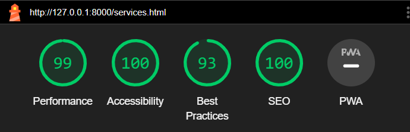
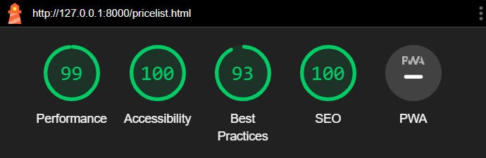
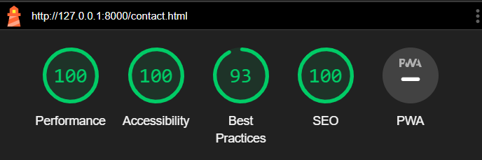

### Functional Testing

| Test                               | Steps                                                       | Expected                                                                                                                                  | Actual                                                                                |
| ---------------------------------- | ----------------------------------------------------------- | ----------------------------------------------------------------------------------------------------------------------------------------- | ------------------------------------------------------------------------------------- |
| Navigation Links                   | Click on link to each page                                  | To be redirected to relevant page                                                                                                         | Redirected to correct page for every link                                             |
| Form - correct inputs              | enter: email,phone & message                                | To be redirected to thankyou page                                                                                                         | Redirected to thankyou page                                                           |
| Form - missing email               | fill in all inputs besides email                            | The form does not submit and an Error is displayed to tell the user that the field is required.                                           | Website behaved as expected, error message was displayed and the form did not submit. |
| Form - missing phone               | fill in all inputs besides phone                            | The form does not submit and an Error is displayed to tell the user that the field is required.                                           | Website behaved as expected, error message was displayed and the form did not submit. |
| Form - incorrect phone input       | fill in all inputs & incorrectly fill in phone with letters | The form does not submit and an Error is displayed to tell the user that a valid email is required and the format it should be in.        | Website behaved as expected, error message was displayed and the form did not submit. |
| Form - incorrect email input       | fill in all inputs & incorrectly fill in email              | The form does not submit and an Error is displayed to tell the user that a valid phone number is required and the format it should be in. | Website behaved as expected, error message was displayed and the form did not submit. |
| Footer - social media icons        | Click icons                                                 | Redirected to relevant social media app                                                                                                   | Redirected to relevant social media app                                               |
| Book appointments link - header    | click book appointments link in header                      | Redirected to third party booking app                                                                                                     | Redirected to third party booking app                                                 |
| Book appointments link - services  | click book appointments link on services page               | Redirected to third party booking app                                                                                                     | Redirected to third party booking app                                                 |
| Book appointments link - pricelist | click book appointments link on pricelist page              | Redirected to third party booking app                                                                                                     | Redirected to third party booking app                                                 |

### Validators

- HTML
- CSS

## Deployment

### Version Control

The site was created using the Visual Studio code editor and pushed to github to the remote repository ‘hair-salon’.

The following git commands were used throughout development to push code to the remote repo:

git add <file> - This command was used to add the file(s) to the staging area before they are committed.

git commit -m “commit message” - This command was used to commit changes to the local repository queue ready for the final step.

git push - This command was used to push all committed code to the remote repository on github.

### Deployment to Github Pages

The site was deployed to GitHub pages. The steps to deploy are as follows:
In the GitHub repository, navigate to the Settings tab
From the menu on left select 'Pages'
From the source section drop-down menu, select the Branch: main
Click 'Save'
A live link will be displayed in a green banner when published successfully.
The live link can be found here - https://jxkeorton.github.io/hair-salon/

### Clone the Repository Code Locally

Navigate to the GitHub Repository you want to clone to use locally:

Click on the code drop down button
Click on HTTPS
Copy the repository link to the clipboard
Open your IDE of choice (git must be installed for the next steps)
Type git clone copied-git-url into the IDE terminal
The project will now of been cloned on your local machine for use.

## Credits

### Dee Mc ( my mentors youtube channel)

404.html with github pages - https://www.youtube.com/watch?v=Jj42_s3KnuM

### WEB CIFAR (youtube channel)

Overlapping Layout With CSS Flex Box - https://www.youtube.com/watch?v=_HTL0XSMcRQ

### Animista

nav element fade in animation - https://animista.net/

### Cloud convert

png to webp converter - https://cloudconvert.com/webp-converter

### Canva

logo design and services images - https://www.canva.com/

### Table to markdown

Google sheets to markdown table converter - https://tabletomarkdown.com/

### CSS Validator

https://jigsaw.w3.org/css-validator/validator#warnings

### HTML Validator

https://validator.w3.org/
